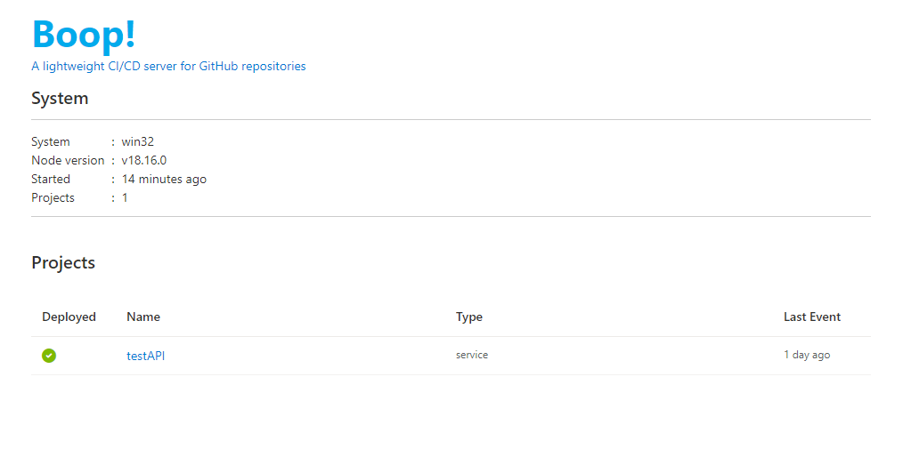
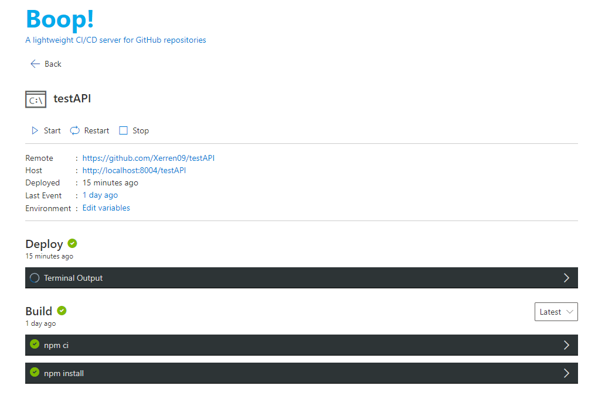
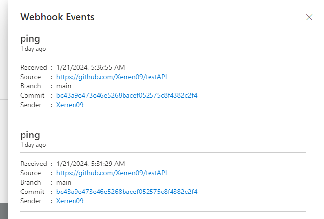
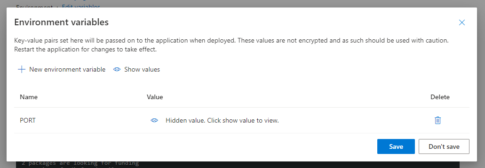
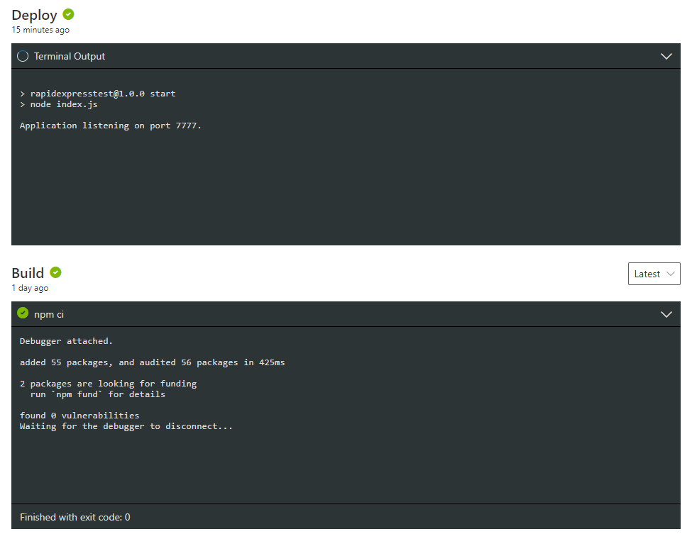

# Boop!
Boop! is a tiny NodeJS CI/CD server that can pull, build and host your Node apps when in need of a quick development server!

## Features

* __GitHub webhook integration:__
Simply set up a webhook in your repository's settings pointing at a server running Boop, and add the required config file to the repo's root.
* __Automatic build and host:__
Once a valid event was received, Boop will attempt to clone the repository, build the project according to the steps in the config file, and then host the project.
* __Simple web UI:__
The project data, and each step of the build process is available through a simplistic web UI, making troubleshooting way more convenient.

## Install

Boop requires at least **NodeJS v16.9.0**, and git to be installed.

Install the app globally: 

`npm install --global @Xerren09/boop`

Then just run:

`boop --secret <secret_hash>`

By default Boop will listen on port 8004. This can be changed:

`boop --port 1234`

## Security

Disclaimer here. Boop is intended for scenarios where you have your own server and know how to safely configure it; and it was built with that in mind. 

Webhooks should be secured with a `secret`. This can be either set through a .env file in Boop's root, or through the `--secret` flag on startup:

`boop --secret <hash>`

See [Securing your webhooks](https://docs.github.com/en/developers/webhooks-and-events/webhooks/securing-your-webhooks) for more.

**Omitting a `secret` will allow anyone to use Boop and host their own projects.** 

Boop also exposes some dangerous APIs. It should always run behind a well configured webserver that only exposes the desired routes.

## Project configuration

Boop needs a small configuration file to recognize projects. Simply add a `.boop` directory to the root of your repository and then add a [`config.yaml`](./docs/config.yaml) file to it:

```yaml
type: service
branch: main
build:
  - npm install
  - npm run build
deploy:
  env:
    port: 7777
  entry: npm run start
```
| Key           | Values | Description |
|---------------|---|---|
| type          | service / webapp | Determines the type of the project. This will tell Boop if the build's result should be treated as a in-browser webapp (e.g.: react app) or an on server service (e.g.: RestAPI). | 
| branch        | string | The branch from which events will be accepted. Events from any other branch will be ignored.  |
| build         | string[] | The list of commands to build the project. They are run in the project's own directory. |
| env           | number / boolean / string | List of Environment Variables to be passed to the project. This is only used if the project's type is `service`, otherwise can be left out entirely. |
| entry | string | The main "executable" of the project. Can be either a command if it is an app, or a relative path if it is a static website (relative from the project's root). Boop will figure out the rest. |

Projects will always be hosted under their github repository's name:

`/<repository-name>/`

All requests to that route will be passed down to the project's own handler.

**Note:** For webapps it might be necessary to compile them knowing the base route will be the project's own name (for example with React apps, set the `homepage` field to the project's name in the package.json file)

## Webhook

Webhook events can be directed to the following route:

`/boop/webhook`

Note: if multiple events are received for a project while it is busy, only the last one received will be kept. Once the project handlers are free again, the last event will be processed.

**Any route beginning with `/boop/` should not be freely exposed to the internet.** Other routes are project specific, but it is highly recommended to individually set a redirect on your webserver and not blanket allow them.

## Web UI

Boop comes with a simple web UI available on `/boop`. It was made with Microsoft's [FluentUI 8 in React](https://developer.microsoft.com/en-us/fluentui#/controls/web), so it should be fairly familiar. The UI provides real time access to terminal outputs and manual management controls for each project hosted.

### Front page

Since Boop is intended for development only, it exposes some potentially sensitive information about the system it is running on:



### Project details

Project details are available under their repository name on the following path:

`/boop/projects/<repo-name>`

The details page provides all the information about the given project, such as the last webhook event that occurred, the project's repository, current host, and more.

In case of a `service`, the project can also be stopped and restarted manually.



#### Webhook Events

The past 25 Webhook events can be checked with their most important information:



#### Environment Variables

Some environment variables (e.g.: API keys) should not be added to the repository's workflow file. These variables can be added separately, and will persist between builds.

**However, the values are not encrypted, and are stored in plaintext on the server. They can potentially be read by other projects.**



#### Build and Deploy terminal output:

Build and Deploy terminal outputs are shown real-time. An icon next to the command indicates the status at-a-glance (in the case of an error, the exit code is also displayed after the command).

For build logs, the past 25 logs are also available via the dropdown selector next to the section header.

__Since these are unfiltered terminal outputs, they may expose project vulnerabilities.__



### Logs

Boop will push its nose into most events happening and will log them like a good boy. If anything bad happens, see `./boop.log` for details.