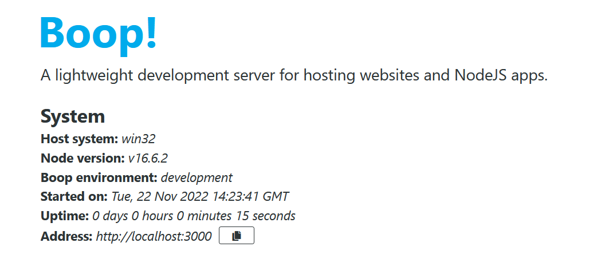
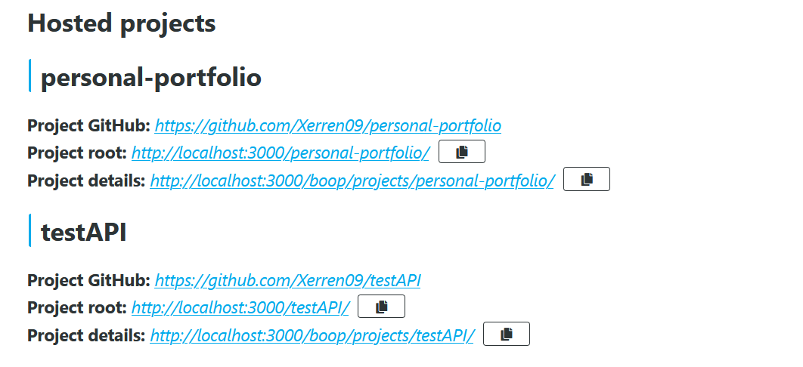
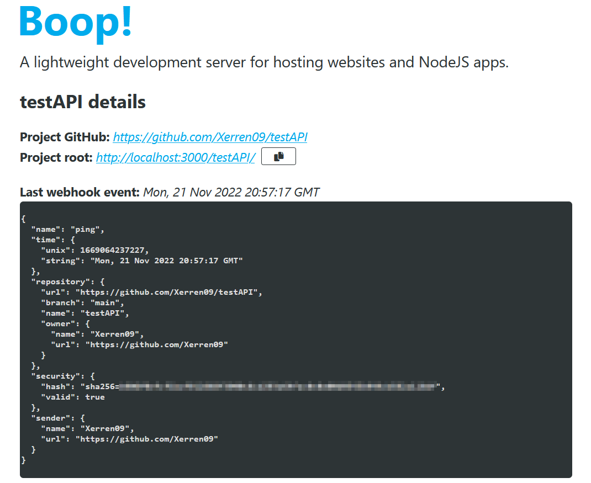
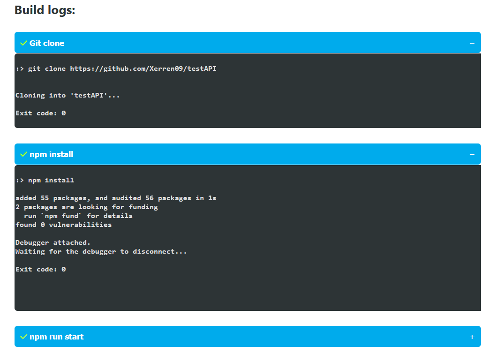

# Boop!
Boop! is a tiny Node app that can pull, build and host your Node apps when in need of a quick development server!

## Features

* __GitHub webhook integration:__
Simply set up a webhook in your repository's settings pointing at boop, and add the required config file to the repo's root.
* __Automatic build and host:__
Once a valid event was received, Boop will attempt to clone the repository, build the project according to the steps in the config file, and then host the project.
* __Simple web client:__
The project data, and each step of the build process is available online, making troubleshooting way more convenient.


## Setup

Build with `npm run build`, then run `boop.js`.
Boop will autogenerate the directories it needs on startup, and should be good to go from there.

By default it is available at `localhost:8004/`.

_Git is required in order to clone repositories._

## Project configuration

Boop needs a small configuration file to recognize projects. Simple add a new file to the repository root named `boop.config.json` with the following contents:

```json
{
  "branch": "main",
  "build": [
    "npm install",
    "npm run build"
  ],
  "run": "./build/index.html"
}
```
|||
|---------------------|---|
| branch        | The branch from which events will be accepted. Events from any other branch will be discarded.  |
| build         | The list of commands to build / install the project. They are run in the project's own directory. |
| run           | The main "executable" of the project. Can be either a command if it is an app, or a relative path if it is a static website (relative from the project's root). Boop will figure out the rest. |

Projects will always be hosted under their github repository name:

`<host>/<repo-name>`

All requests to that URL will be passed down to the project's own handler.

## Webhook

After setting up a `secret` in both the target github repo and in Boop's .env file (string, key: `SECRET`), webhooks are handled on the following handle:

`<host>/boop/webhook`

See [Securing your webhooks](https://docs.github.com/en/developers/webhooks-and-events/webhooks/securing-your-webhooks) for more.

Note: while Boop can handle multiple requests at a time, webhook events for the same project will be discarded if it is already building. _Resend the last event from GitHub after the build process is done._

## Front page

`<host>/`

Since Boop is intended for development only, it exposes some potentially sensitive information about the system it is running on:



### Projects

Under the system info section is the list of currently hosted projects:



These sections provide quick access to the project's GitHub repository, the host URL where the project is running, and Boop's details page.

## Project details

Project details are available under their repository name on the following path:

`<host>/boop/projects/<repo-name>`

The details page provides all of the internal data about the given project, such as the last webhook event that occurred, the project config (both in JSOn format) and the build details.



#### Build details:

The build logs are separated into dropdown boxes, in the order they are executed. A green checkmark or red cross next to the command indicated the status at a glance (in the case of an error, the exit code is also displayed after the command).

__Since these are unfiltered build outputs, they may expose project vulnerabilities.__

