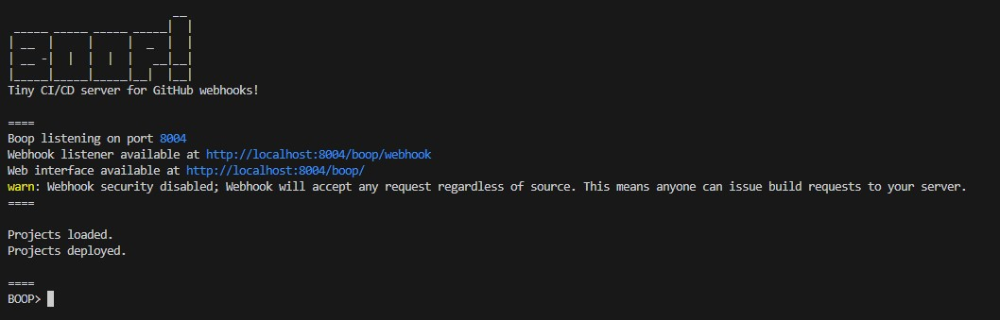
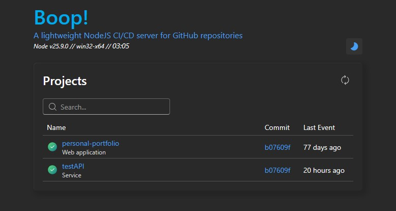
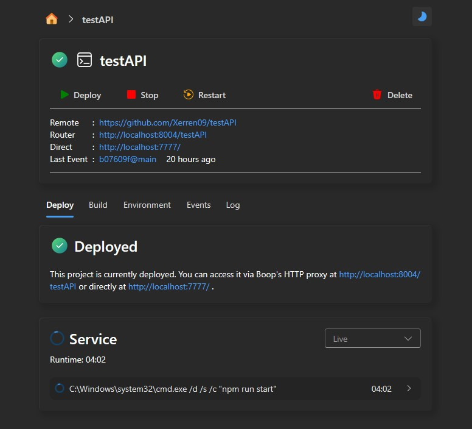
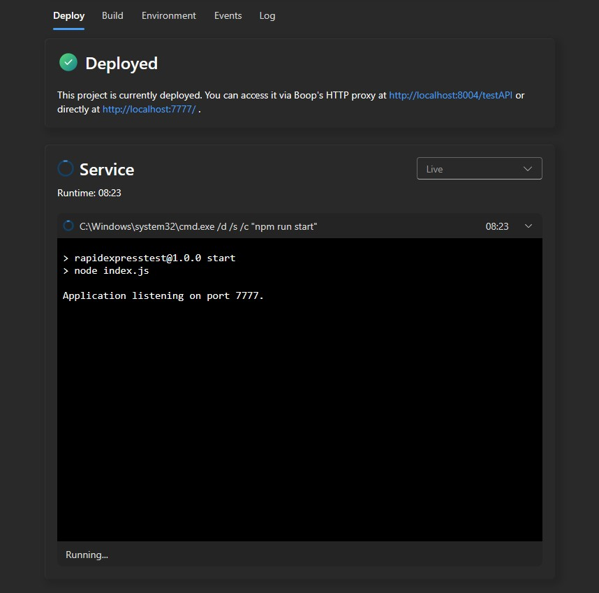
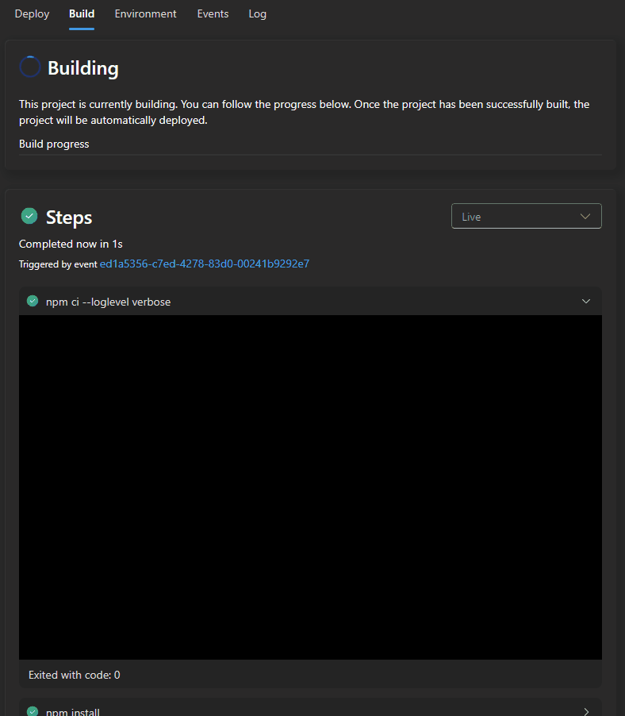
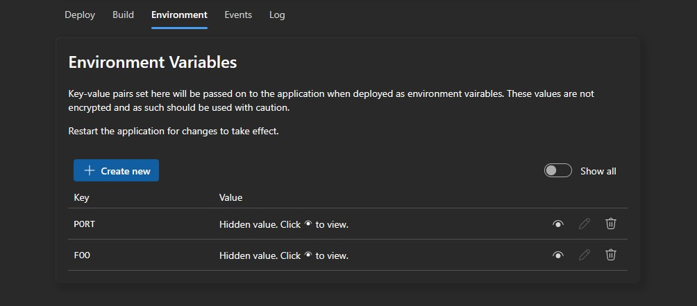
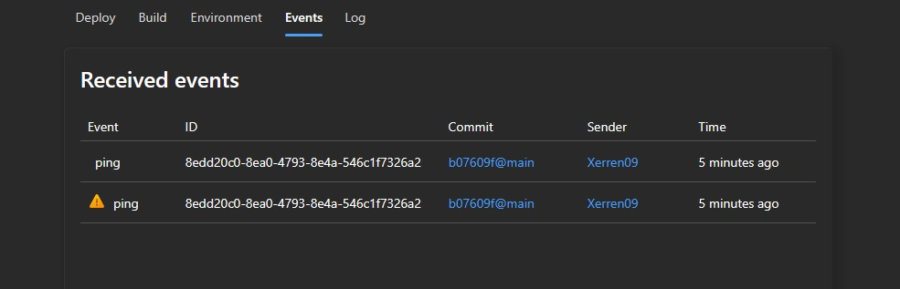
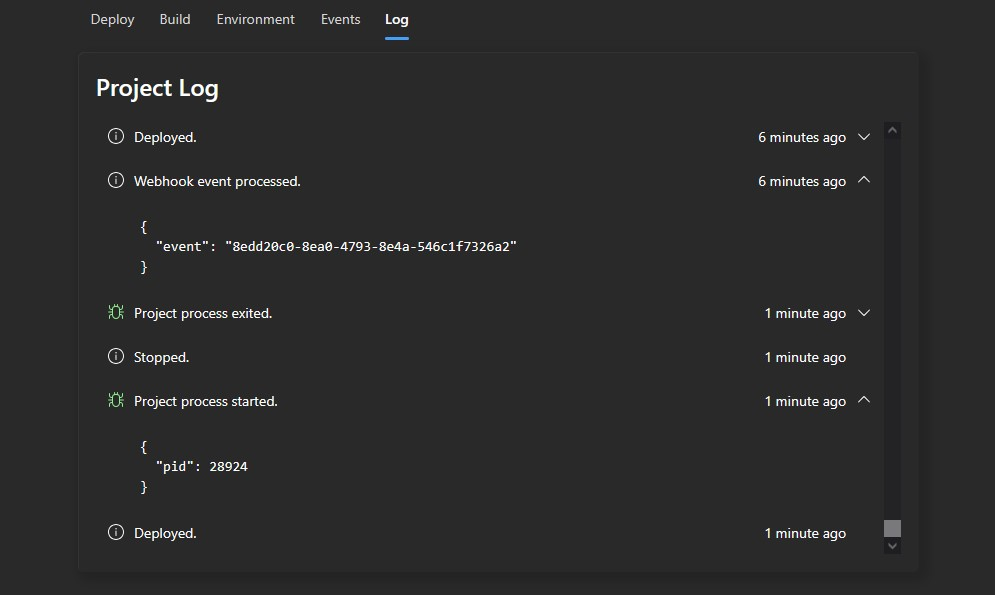

# Boop!
Boop! is a tiny NodeJS CI/CD server that can pull, build and host your Node apps when in need of a quick development server!

## Features

* __GitHub webhook integration:__
Simply set up a webhook in your repository's settings pointing at a server running Boop, and add the required config file to the repo's root.
* __Automatic build and host:__
Once a valid event was received, Boop will attempt to clone the repository, build the project according to the steps in the config file, then host the project. Requests will be proxied by Boop, so in most cases no separate routing is necessary to access running projects.
* __Simple web UI:__
The project data, deploy outputs, and each step of the build process is available *live* with their terminal outputs through the dedicated Web UI component.

## Installation

Boop requires at least **NodeJS v25.2.1**, and git to be installed.

Install the app globally: 

`npm install --global @xerren09/boop`

Then just run:

`boop --secret <webhook_signature>`

By default Boop will listen on port `8004`. This can be changed:

`boop --port 1234`

Projects are installed into the current user's home folder, in the `.boop` directory.

## Security

Disclaimer here. Boop is intended for scenarios where you have your own server and know how to safely configure it; and it was built with that in mind.

> [!WARNING]  
> Boop also exposes some dangerous APIs. It should always run behind a well configured webserver that only exposes the desired routes.

### Webhooks

Webhooks should be secured with a secret that will be used to verify incoming webhook payloads. This can be either set through a .env file in Boop's working root via the `SECRET` key or through the `--secret` argument:

`boop --secret <signature>`

Or in `USERHOME\.boop\.env`:

```env
SECRET=signature
```

> [!CAUTION]  
> **Omitting a `secret` will allow anyone to use Boop and push updates to your deployed projects.**

> [!NOTE]
> See GitHub's guide on [securing your webhooks](https://docs.github.com/en/developers/webhooks-and-events/webhooks/securing-your-webhooks) for more.

## Project configuration

Boop needs a small configuration file to recognize how to handle projects. Simply add a `.boop` directory to the root of your repository and then add a [`config.yaml`](./docs/config.yaml) file to it:

```yaml
type: service
branch: main
build:
  - npm install
  - npm run build
deploy:
  env:
    port: 7777
  entry: npm run start
```
| Key           | Type / Values | Description |
|---------------|---|---|
| type          | service / webapp | Determines the type of the project. This will tell Boop if the project is an in-browser application (e.g.: client-side rendered react app) or a server-side service (e.g.: an ExpressJS webserver). | 
| branch        | string | The branch from which events will be accepted. Events from any other branch will be dropped.  |
| build         | string[] | The list of commands to build the project. They are run in the project's own directory. |
| env           | number / boolean / string | List of environment variables to be passed to the project. This is only used if the project's type is `service`, otherwise can be left out entirely. |
| entry | string | The main entry point of the project. Can be either a command if it is a `service`, or a relative path (from the project's root) to a file if it is a `webapp`. Boop will figure out the rest. |

## Deployments

To avoid always having to manually set up port-forwarding to individual projects, Boop automatically attemps to make deployed projects available through its own HTTP service.

Projects will be hosted under their github repository's name:

`localhost:8004/<repository-name>/`

All requests to these routes will be proxied by Boop and sent to the project:

### Webapps

Once built, static web applications are hosted directly by Boop. The configuration file's `entry` property should point to an HTML file, then that and its containing directory will be made available.

> [!NOTE]
> For SPAs it is necessary to compile them knowing the base route will be the project's own name. See [Public Base Path for Vite](https://vite.dev/guide/build#public-base-path), and [`basePath` for Next.JS](https://nextjs.org/docs/pages/api-reference/config/next-config-js/basePath) based projects.

### Services

Service projects are started as a child process and a basic HTTP proxy is created to forward request to it. This depends on the the `PORT` environment variable set either in the configuration yaml file, or through the web UI. 

Both HTTP requests and WebSockets are proxied. Since you might want to access service projects independently on their own port, Boop's proxy will rewrite requests handled by it to remove the `\project-name\` segment when passing them forward to your app.

> [!IMPORTANT]  
> Proxies will not be started if the service's listening port is not explicitly given to Boop.

## Webhook

Webhook events from GitHub can be directed to the following route:

`/boop/webhook`

> [!NOTE]  
> If multiple valid events are received for a project in quick succession, the currently pending one will be cancelled. If an event is already queued it will be discarded completely, and only the latest event will be processed.

> [!WARNING]  
> **Any route beginning with `/boop/` should not be freely exposed to the internet.** They allow for full access to Boop through its API!

# Interfaces

Boop offers two control interfaces, a CLI which is always available, and a WebUI which is an optional component.

## CLI



### > start
Accepted arguments: `<project-name>`, `all`

Starts a given project.

### > stop
Accepted arguments: `<project-name>`, `all [-force]`

Stops a given project. Stopped projects are unavailable through proxies, and in the case of service projects, they are killed.

### > restart
Accepted arguments: `<project-name>`

Stops, then starts a given project.

### > status
Accepted arguments: `<project-name>`, `all`

Prints the list of projects and their statuses.

Example:
```
<name>: Deployed
    Type: service
    Router: http://localhost:<BOOP_PORT>/<project-name>
    Direct: http://localhost:<PROJECT_ENV_PORT>/

<name>: Stopped
    Type: webapp
    Router: http://localhost:<BOOP_PORT>/<project-name>
    Index: <index-file-path>
```

### > install
Accepted arguments: `<repository-url>`

Clones a git repository from the URL and registers it as a project if a configuration file exists, then builds and deploys it. The URL is directly passed to git, so any it can parse is accepted. 

Projects are installed into the current user's home folder, in the `.boop` directory.

### > uninstall
Accepted arguments: `<project-name>`

Remove a given project.

> [!CAUTION]
> Deleted projects are shut down and permanently wiped from disk, along with all logs and files. This is irreversible.

### > exit
Shuts down all project handlers and their sub-processes, then exists Boop.

### > help
Prints the same command list and information as this section.

## Web UI

Boop comes with a simple web UI available on `/boop`. It was built with Microsoft's [FluentUI 9 in React](https://github.com/microsoft/fluentui), so it should be fairly familiar to use. It provides real time access to process outputs and manual management controls for each project hosted.



### Project page

Project details are available under their repository name on the following path:

`/boop/<repository-name>`

The main page provides all the most important information about a project, like status, the proxy and direct connection URLs, and current project version, along with management controls.



### Tabs

#### Deploy

Provides a quick description about the current deployment status and ways to access the project.

If the project is a service project, it will also contain the live output of the service process, along with past deploy logs.



#### Build

Provides a description about the current build status, along with live updates of the build steps. Previous build process logs can also be accessed here.



### Environment Variables

Some environment variables (e.g.: API keys) should not be added to the repository's workflow file directly. These variables can be added here separately, and will persist between builds. If an variable is declared here and in the workflow file, the latter will always overwrite it on next build.

> [!WARNING]  
> Environment variables are not encrypted and are stored in plaintext. They can potentially be read by other projects.

> [!NOTE]
> This tab is hidden for `webapp` projects, as they do not need runtime environments.



### Events

Past Webhook events can be checked with their most important information:



> [!NOTE]  
> Unverified but accepted events are marked with a ⚠️ icon.

### Log

Projects independently log every action and event, which are available in a list:

